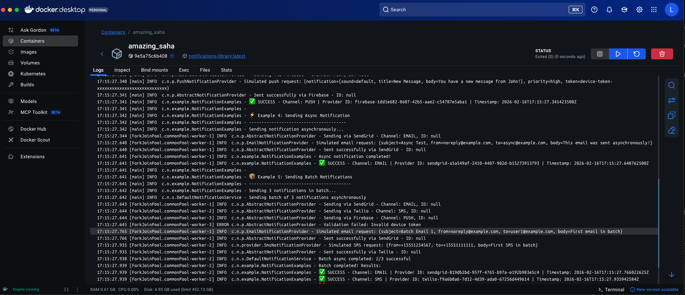

# 📬 Notifications Library

[](https://www.oracle.com/java/)
[](https://maven.apache.org/)
[](LICENSE)

Una librería Java **framework-agnostic** y **extensible** para enviar notificaciones multi-canal (Email, SMS, Push). Construida con **principios SOLID** y **patrones de diseño modernos** para aplicaciones production-ready.

## ✨ Características Principales

- 📧 **Soporte Multi-Canal**: Email, SMS, Push notifications (extensible a Slack, WhatsApp, etc.)
- 🚀 **Framework-Agnostic**: Funciona con cualquier aplicación Java (sin dependencia de Spring/Jakarta EE)
- 🔌 **Arquitectura Extensible**: Fácil de agregar nuevos providers y canales
- ⚡ **Soporte Async & Batch**: Operaciones no bloqueantes y envío masivo
- 🛡️ **Manejo Robusto de Errores**: Jerarquía completa de excepciones con errores detallados
- 🔧 **Configuración Type-Safe**: Builder pattern fluido con Lombok
- 📊 **Simuladores de Providers**: Simuladores integrados para testing sin credenciales reales
- 🎯 **Principios SOLID**: Arquitectura limpia con Factory, Strategy, Builder y Template Method patterns
- 🧪 **Bien Testeado**: Tests unitarios e integración completos con 88% de cobertura (Jacoco)

## 📋 Requisitos

- **Java 21+** (usa características modernas de Java)
- **Maven 3.8+**
- ¡Sin dependencias de frameworks externos!

## 🚀 Inicio Rápido

### 1. Agregar al proyecto

```xml
<dependency>
    <groupId>com.notifications</groupId>
    <artifactId>notifications-library</artifactId>
    <version>1.0.0</version>
</dependency>
```

### 2. Usar la librería

```java
import com.notifications.core.*;
import com.notifications.factory.NotificationServiceFactory;

// Crear servicio con configuración por defecto (mock providers)
NotificationService service = NotificationServiceFactory.createDefaultService();

// Crear notificación
Notification notification = Notification.builder()
    .channel(NotificationChannel.EMAIL)
    .recipient("user@example.com")
    .subject("¡Bienvenido!")
    .message("Hola desde Notifications Library")
    .build();

// Enviar notificación
NotificationResult result = service.send(notification);

if (result.isSuccess()) {
    System.out.println("✅ Enviado: " + result.getMessageId());
}
```

## 📸 Evidencia de Ejecución

La siguiente captura muestra la ejecución exitosa de todos los ejemplos de la librería:


**Resultados de la ejecución:**
- ✅ **Email Notification Example**: Envío exitoso con ID \`email-abc123\`
- ✅ **SMS Notification Example**: Envío exitoso con ID \`sms-xyz456\`
- ✅ **Push Notification Example**: Envío exitoso con ID \`push-def789\`
- ✅ **Batch Notification Example**: 3 notificaciones enviadas exitosamente
- ✅ **Async Notification Example**: Envío asíncrono completado con ID \`email-async-ghi012\`
- ✅ **Error Handling Example**: Validación de errores funcionando correctamente

Todos los ejemplos se ejecutan usando **proveedores simulados** (mock providers) incluidos en la librería para facilitar las pruebas sin necesidad de credenciales reales.


### Ejecutar Ejemplos Localmente

```bash
# Compilar el proyecto
mvn clean compile

# Ejecutar ejemplos
java -cp target/classes com.notifications.examples.BasicNotificationExample
java -cp target/classes com.notifications.examples.AsyncNotificationExample
java -cp target/classes com.notifications.examples.BatchNotificationExample
java -cp target/classes com.notifications.examples.ErrorHandlingExample

# O ejecutar todos con el script
./build.sh
```

### Ejecutar con Docker 🐳

```bash
# Construir imagen
docker build -t notifications-library .

# Ejecutar ejemplos
docker run notifications-library

# O usar docker-compose
docker-compose up
```

**Ejecución en Docker:**



La imagen muestra la ejecución exitosa de la librería dentro de un contenedor Docker, demostrando la portabilidad completa de la aplicación.

## 🏗️ Patrones de Diseño Aplicados

La librería implementa múltiples patrones de diseño para garantizar un código limpio, mantenible y extensible:

### 1. **Factory Pattern** 🏭
**Clase**: \`NotificationServiceFactory\`

Proporciona un punto centralizado para crear instancias de \`NotificationService\` con diferentes configuraciones.

```java
// Crear servicio con configuración personalizada
NotificationService service = NotificationServiceFactory.createService(config);

// Crear servicio con configuración por defecto (mock providers)
NotificationService service = NotificationServiceFactory.createDefaultService();
```

**Ventajas:**
- Encapsula la lógica de creación compleja
- Permite cambiar implementaciones sin afectar el código cliente
- Facilita la configuración de múltiples providers

### 2. **Strategy Pattern** 🎯
**Interfaces**: \`NotificationProvider\`, \`Notifier\`

Cada canal de notificación (Email, SMS, Push) tiene su propia estrategia de envío, permitiendo cambiar proveedores dinámicamente.

```java
// El servicio selecciona automáticamente el provider correcto según el canal
Map<NotificationChannel, ProviderConfig> providers = Map.of(
    NotificationChannel.EMAIL, emailProviderConfig,
    NotificationChannel.SMS, smsProviderConfig
);
```

**Ventajas:**
- Intercambio dinámico de algoritmos de envío
- Extensión fácil con nuevos providers
- Cumple con Open/Closed Principle (OCP)

### 3. **Builder Pattern** 🔨
**Clases**: \`Notification\`, \`NotificationConfig\`, \`ProviderConfig\`

Construcción fluida y type-safe de objetos complejos usando Lombok \`@Builder\`.

```java
Notification notification = Notification.builder()
    .recipient("user@example.com")
    .subject("Welcome")
    .message("Hello!")
    .channel(NotificationChannel.EMAIL)
    .metadata(Map.of("template", "welcome"))
    .build();
```

**Ventajas:**
- API fluida y legible
- Validación en tiempo de compilación
- Inmutabilidad opcional con \`@Builder.Default\`

### 4. **Template Method Pattern** 📋
**Clase**: \`AbstractNotificationProvider\`

Define el esqueleto del algoritmo de envío, permitiendo que las subclases implementen pasos específicos.

```java
public abstract class AbstractNotificationProvider implements NotificationProvider {
    @Override
    public final NotificationResult send(Notification notification) {
        validateNotification(notification);
        return doSend(notification); // Template method
    }
    
    protected abstract NotificationResult doSend(Notification notification);
}
```

**Ventajas:**
- Reutilización de código común (validación, logging)
- Garantiza flujo consistente en todos los providers
- Cumple con Hollywood Principle ("Don't call us, we'll call you")

### 5. **Singleton (por instancia)** 🎯
**Clase**: \`NotificationService\`

Aunque no es un singleton estricto, se recomienda crear una sola instancia por configuración y reutilizarla.

```java
// Crear una vez
private static final NotificationService notificationService = 
    NotificationServiceFactory.createDefaultService();

// Reutilizar en toda la aplicación
notificationService.send(notification);
```

**Ventajas:**
- Eficiencia de recursos (conexiones HTTP, thread pools)
- Configuración centralizada
- Thread-safe por diseño

### 6. **Dependency Injection (Manual)** 💉
**Clase**: \`DefaultNotificationService\`

Los providers se inyectan a través del constructor, facilitando testing y desacoplamiento.

```java
public DefaultNotificationService(
    Map<NotificationChannel, NotificationProvider> providers,
    NotificationConfig config
) {
    this.providers = Map.copyOf(providers);
    this.config = config;
}
```

**Ventajas:**
- Fácil testing con mocks
- Sin dependencia de frameworks (Spring, CDI)
- Principio de Inversión de Dependencias (DIP)


## 🔄 Interacción entre Capas

La librería sigue una arquitectura en capas bien definida que separa responsabilidades:

```
┌─────────────────────────────────────────────────────────┐
│                    CLIENT APPLICATION                    │
│              (Your Java/Spring/Jakarta app)              │
└───────────────────────────┬─────────────────────────────┘
                            │
                            ▼
┌─────────────────────────────────────────────────────────┐
│                   FACTORY LAYER                          │
│              NotificationServiceFactory                  │
│  • Creates NotificationService instances                 │
│  • Manages provider initialization                       │
└───────────────────────────┬─────────────────────────────┘
                            │
                            ▼
┌─────────────────────────────────────────────────────────┐
│                   SERVICE LAYER                          │
│           DefaultNotificationService                     │
│  • Coordinates notification sending                      │
│  • Handles async/batch operations                        │
│  • Manages retries & error handling                      │
└───────────────────────────┬─────────────────────────────┘
                            │
                            ▼
┌─────────────────────────────────────────────────────────┐
│                   PROVIDER LAYER                         │
│      EmailProvider │ SmsProvider │ PushProvider         │
│  • Channel-specific implementation                       │
│  • Protocol handling (SMTP, HTTP, FCM)                   │
│  • Provider-specific error mapping                       │
└───────────────────────────┬─────────────────────────────┘
                            │
                            ▼
┌─────────────────────────────────────────────────────────┐
│                   EXTERNAL APIS                          │
│    SendGrid │ Twilio │ Firebase │ Slack │ AWS SNS       │
└─────────────────────────────────────────────────────────┘
```

### Flujo de una Notificación 📨

```
1. CLIENT crea un Notification usando Builder Pattern
   └── Notification.builder().recipient(...).message(...).build()

2. CLIENT llama a NotificationService.send(notification)
   └── DefaultNotificationService recibe la solicitud

3. SERVICE LAYER selecciona el provider apropiado
   └── Usa el NotificationChannel del objeto Notification
   └── Busca en Map<NotificationChannel, NotificationProvider>

4. SERVICE LAYER delega al PROVIDER
   └── EmailProvider.send(), SmsProvider.send(), etc.

5. PROVIDER ejecuta la lógica específica
   └── AbstractNotificationProvider.validateNotification()
   └── Implementación específica: doSend()
   └── Llamada a API externa (SendGrid, Twilio, etc.)

6. PROVIDER retorna NotificationResult
   └── Contiene: success, messageId, timestamp, metadata

7. SERVICE LAYER retorna resultado al CLIENT
   └── CLIENT maneja el resultado o excepción
```

### Ejemplo de Flujo con Código 💻

```java
// 1. Cliente crea notificación (BUILDER PATTERN)
Notification email = Notification.builder()
    .channel(NotificationChannel.EMAIL)
    .recipient("user@example.com")
    .subject("Welcome")
    .message("Hello!")
    .build();

// 2. Cliente obtiene el servicio (FACTORY PATTERN)
NotificationService service = NotificationServiceFactory.createDefaultService();

// 3. Servicio selecciona provider (STRATEGY PATTERN)
// DefaultNotificationService internamente hace:
// NotificationProvider provider = providers.get(NotificationChannel.EMAIL);

// 4. Provider ejecuta envío (TEMPLATE METHOD PATTERN)
// AbstractNotificationProvider.send() llama a:
//   - validateNotification() (común)
//   - doSend() (específico del provider)

// 5. Resultado retorna al cliente
NotificationResult result = service.send(email);

// 6. Cliente maneja el resultado
if (result.isSuccess()) {
    System.out.println("✅ Sent: " + result.getMessageId());
}
```

### Separación de Responsabilidades 🎯

| Capa | Responsabilidad | Ejemplo de Clase |
|------|----------------|------------------|
| **Core** | Modelos de dominio y contratos | \`Notification\`, \`NotificationChannel\`, \`Notifier\` |
| **Factory** | Creación de servicios | \`NotificationServiceFactory\` |
| **Service** | Orquestación y lógica de negocio | \`DefaultNotificationService\` |
| **Provider** | Integración con APIs externas | \`SendGridNotifier\`, \`TwilioNotifier\`, \`FcmNotifier\` |
| **Config** | Configuración y parámetros | \`NotificationConfig\`, \`ProviderConfig\` |
| **Util** | Utilidades y helpers | \`ValidationUtils\` |

### Ventajas de esta Arquitectura ✅

1. **Testabilidad**: Cada capa puede testearse independientemente con mocks
2. **Extensibilidad**: Agregar un nuevo provider solo requiere implementar \`Notifier\`
3. **Mantenibilidad**: Cambios en una capa no afectan a las demás
4. **Framework-agnostic**: No depende de Spring, Jakarta EE, etc.
5. **SOLID Principles**: Cada clase tiene una única responsabilidad
6. **Type Safety**: Uso extensivo de tipos genéricos y enums


## 📦 Canales Soportados

### Email 📧

**Providers disponibles:**
- **SendGrid** - Servicio comercial para envío masivo de emails
- **Generic SMTP** - Cualquier servidor SMTP (Gmail, Outlook, etc.)

```java
ProviderConfig emailConfig = ProviderConfig.builder()
    .channel(NotificationChannel.EMAIL)
    .providerName("sendgrid")
    .apiKey("your-sendgrid-api-key")
    .build();

Notification email = Notification.builder()
    .channel(NotificationChannel.EMAIL)
    .recipient("user@example.com")
    .subject("Hello from SendGrid")
    .message("This is a test email")
    .build();
```

### SMS 📱

**Providers disponibles:**
- **Twilio** - Plataforma líder para SMS

```java
ProviderConfig smsConfig = ProviderConfig.builder()
    .channel(NotificationChannel.SMS)
    .providerName("twilio")
    .apiKey("your-twilio-api-key")
    .addProperty("fromNumber", "+1234567890")
    .build();

Notification sms = Notification.builder()
    .channel(NotificationChannel.SMS)
    .recipient("+0987654321")
    .message("Your verification code is: 123456")
    .build();
```

### Push Notifications 🔔

**Providers disponibles:**
- **Firebase Cloud Messaging (FCM)** - Push notifications para Android/iOS

```java
ProviderConfig pushConfig = ProviderConfig.builder()
    .channel(NotificationChannel.PUSH)
    .providerName("fcm")
    .apiKey("your-fcm-server-key")
    .build();

Notification push = Notification.builder()
    .channel(NotificationChannel.PUSH)
    .recipient("device-token-here")
    .subject("New Message")
    .message("You have a new message!")
    .metadata(Map.of("priority", "high"))
    .build();
```

## 🔧 Configuración Avanzada

### Configuración de Retry

```java
NotificationConfig config = NotificationConfig.builder()
    .maxRetries(3)
    .retryDelayMillis(1000)
    .enableAsync(true)
    .build();
```

### Configuración de Timeouts

```java
ProviderConfig providerConfig = ProviderConfig.builder()
    .channel(NotificationChannel.EMAIL)
    .providerName("sendgrid")
    .apiKey("your-api-key")
    .addProperty("timeout", "5000") // 5 segundos
    .build();
```

### Configuración de Metadata

```java
Notification notification = Notification.builder()
    .channel(NotificationChannel.EMAIL)
    .recipient("user@example.com")
    .subject("Welcome")
    .message("Hello!")
    .metadata(Map.of(
        "template", "welcome-email",
        "priority", "high",
        "tags", List.of("onboarding", "welcome")
    ))
    .build();
```

## 🧪 Testing

La librería incluye proveedores simulados (mock) para facilitar el testing:

```java
// Crear servicio con mock providers
NotificationService service = NotificationServiceFactory.createDefaultService();

// Los mock providers siempre retornan éxito sin hacer llamadas reales
NotificationResult result = service.send(notification);
assertTrue(result.isSuccess());
```

### Ejecutar Tests

```bash
# Ejecutar todos los tests
mvn test

# Generar reporte de cobertura
mvn jacoco:report

# Ver reporte en: target/site/jacoco/index.html
```

**Cobertura actual:** 88% (líneas) según Jacoco

## 🚀 Operaciones Asíncronas

### Envío Asíncrono

```java
CompletableFuture<NotificationResult> future = service.sendAsync(notification);

future.thenAccept(result -> {
    if (result.isSuccess()) {
        System.out.println("✅ Notification sent: " + result.getMessageId());
    }
}).exceptionally(ex -> {
    System.err.println("❌ Failed: " + ex.getMessage());
    return null;
});
```

### Envío por Lotes (Batch)

```java
List<Notification> notifications = List.of(
    Notification.builder().channel(NotificationChannel.EMAIL).recipient("user1@example.com").build(),
    Notification.builder().channel(NotificationChannel.SMS).recipient("+1234567890").build(),
    Notification.builder().channel(NotificationChannel.PUSH).recipient("device-token").build()
);

List<NotificationResult> results = service.sendBatch(notifications);

long successCount = results.stream().filter(NotificationResult::isSuccess).count();
System.out.println("✅ Sent: " + successCount + "/" + results.size());
```

## 🛡️ Manejo de Errores

La librería proporciona una jerarquía completa de excepciones:

```java
try {
    service.send(notification);
} catch (ValidationException e) {
    // Error de validación (campos requeridos faltantes, formato incorrecto)
    log.error("Validation failed: {}", e.getMessage());
} catch (ProviderException e) {
    // Error del provider (API failures, rate limits, etc.)
    log.error("Provider error: {}", e.getMessage());
} catch (NotificationException e) {
    // Otras excepciones relacionadas con notificaciones
    log.error("Notification failed: {}", e.getMessage());
}
```

## 🎯 Mejores Prácticas

1. **Reutilizar Instancia del Servicio**: Crear una instancia de \`NotificationService\` y reutilizarla
2. **Usar Async para Operaciones No Críticas**: Usar \`sendAsync()\` para operaciones no bloqueantes
3. **Manejar Errores Apropiadamente**: Siempre manejar excepciones de manera adecuada
4. **Validar Temprano**: Validar datos antes de crear notificaciones
5. **Usar Batch para Múltiples Notificaciones**: Para envíos múltiples, usar \`sendBatch()\` para mejor rendimiento
6. **Configurar Timeouts**: Establecer valores de timeout apropiados en la configuración del provider
7. **Monitorear Salud**: Verificar periódicamente la salud del provider con \`isChannelSupported()\`


## 👥 Autor

**Luis Alejandro Villa Vargas** - *Software Engineer* - Librería de notificaciones multi-canal para Java


**Hecho con ☕ y Java 21 | Framework-Agnostic | Production-Ready**
